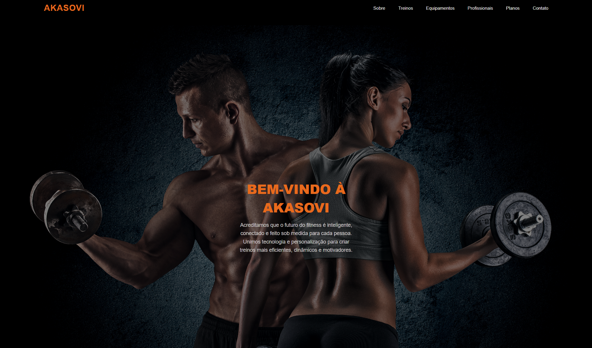

# 🏋️‍♂️ AKASOVI


Uma experiência digital imersiva que simula um centro de treinamento de alta performance, unindo design moderno, animações e conceitos de UX.

---

## 🖼️ Preview do projeto



---

## 🌐 Acesse o projeto online

🔗 https://akasovi-git-main-jenyvesjih.vercel.app/

---

## 📌 Sobre o projeto

A **AKASOVI** é o resultado de um desafio de criação total. O objetivo foi desenvolver uma marca fictícia do zero e construir toda a sua presença digital.

Diferente de uma academia comum, o projeto apresenta um centro de 10.000 m², integrando tecnologia, performance e bem-estar.

O desenvolvimento foi focado em:

- Experiência do usuário (UX)  
- Interface moderna e responsiva  
- Estruturação de páginas web  
- Identidade visual completa  

> 💡 Projeto ideal para demonstrar habilidades em front-end e design digital.

---

## 🚀 O que foi desenvolvido

Além do código, todo o conceito da marca foi criado:

- **Conceito AKASOVI:** academia inteligente e conectada  
- **Tecnologia própria:** simulação de sistemas e dashboards  
- **Metodologia de treino:** Hipertrofia, Emagrecimento e Master (+60)  
- **Equipe:** perfis profissionais completos  
- **Planos:** estrutura de assinaturas com benefícios  

---

## ⚡ Destaques técnicos

- Animações avançadas com **GSAP**  
- Estrutura modular com múltiplas páginas  
- Navegação focada em experiência do usuário (UX)  
- Design responsivo  
- Organização de código escalável  

---

## 🛠️ Tecnologias utilizadas

- HTML5  
- CSS3  
- JavaScript  
- GSAP  
- Font Awesome  

---

## ▶️ Como executar o projeto

### 1. Clone o repositório

```bash
git clone https://github.com/v1kyw/AKASOVI.git
```

### 2. Acesse a pasta

```bash
cd AKASOVI
```

### 3. Abra o site

- Abra `index.html` para a animação inicial  
ou  
- Abra `home.html` para ir direto ao conteúdo  

---

## 💬 Estrutura de navegação

- **Home:** apresentação da marca  
- **Treinos:** escolha de objetivos  
- **Equipamentos:** estrutura e tecnologia  
- **Profissionais:** equipe especializada  
- **Planos:** preços e benefícios  
- **Contato:** formulário de inscrição  

---

## 📂 Estrutura do repositório 

```
📁 akasovi
 ├── 📄 index.html      ← Página inicial
 ├── 📄 index2.html     ← Tela de introdução (Intro)
 ├── 📄 index3.html     ← Página de treinos
 ├── 📄 index4.html     ← Página de equipamentos
 ├── 📄 index5.html     ← Página de profissionais
 ├── 📄 index6.html     ← Página de planos
 ├── 📄 home.html       ← Página de contato
 ├── 📄 README.md       ← Este arquivo
 ├── 📁 css             ← Arquivos de estilização
 └── 📁 js              ← Scripts JavaScript e animações
 └── 📁 img             ← Imagens de fundo das páginas
 └── 📁 img2            ← Imagens dos equipamentos
 └── 📁 img3            ← Imagens dos profissionais
 └── 📁 assets          ← Preview do projeto

```

## ⚠️ Observações

- Projeto acadêmico  
- Dados fictícios  
- Foco em aprendizado e prática de front-end  

---

## 👩‍💻 Equipe

- Ana Clara Tamborini Bossolan  
- Kadu Nunes Zambon Minardi Azevedo
- Sofia Satomi Hagio
- Victoria Haruka Ishi

---

## 📄 Licença

Este projeto é livre para uso educacional e consulta de código.
